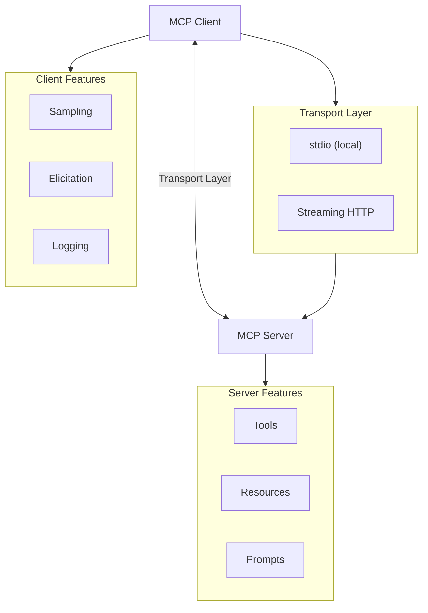
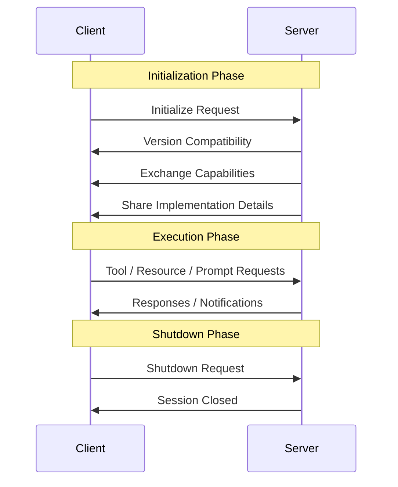

## High-Level MCP Architecture

```mermaid
flowchart TB

    Client["MCP Client"] <-->|Transport Layer| Server["MCP Server"]

    subgraph TransportLayer["Transport Layer"]
        STDIO["stdio (local)"]
        HTTP["Streaming HTTP"]
    end

    Client --> TransportLayer
    TransportLayer --> Server

    subgraph ClientFeatures["Client Features"]
        Sampling["Sampling"]
        Elicitation["Elicitation"]
        Logging["Logging"]
    end

    subgraph ServerFeatures["Server Features"]
        Tools["Tools"]
        Resources["Resources"]
        Prompts["Prompts"]
    end

    Client --> ClientFeatures
    Server --> ServerFeatures
```

## MCP Lifecycle Management

```mermaid
sequenceDiagram
    participant Client
    participant Server

    Note over Client,Server: Initialization Phase

    Client->>Server: Initialize Request
    Server->>Client: Version Compatibility
    Server->>Client: Exchange Capabilities
    Server->>Client: Share Implementation Details

    Note over Client,Server: Execution Phase

    Client->>Server: Tool / Resource / Prompt Requests
    Server->>Client: Responses / Notifications

    Note over Client,Server: Shutdown Phase

    Client->>Server: Shutdown Request
    Server->>Client: Session Closed
```
