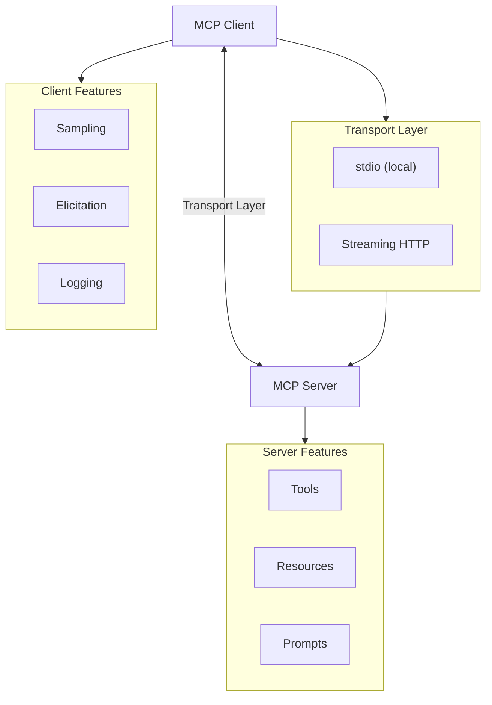
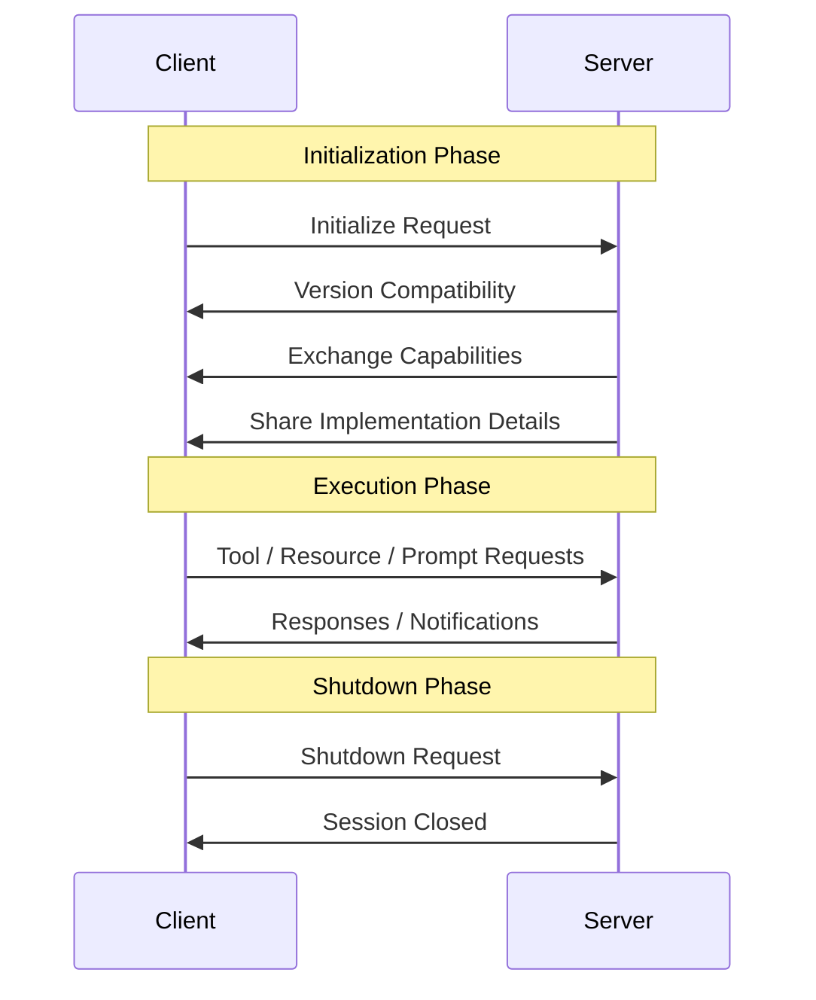
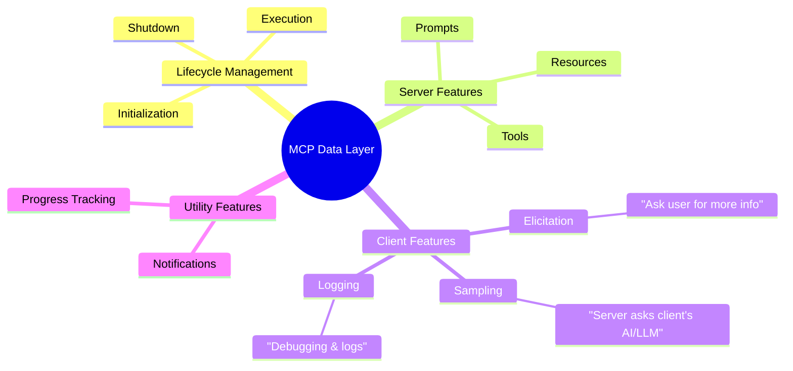
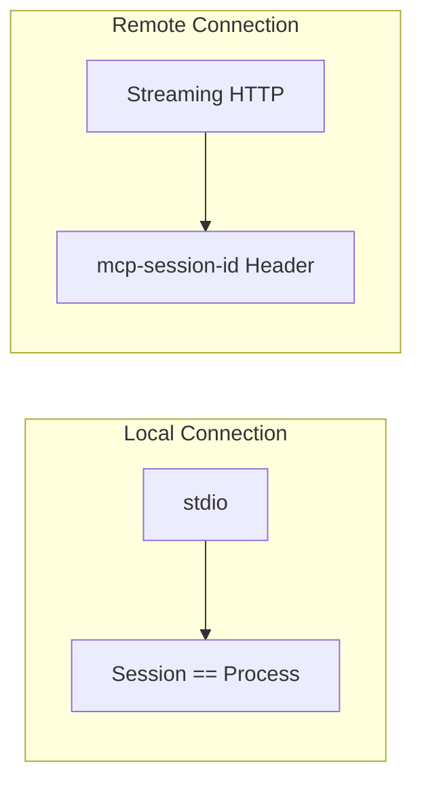
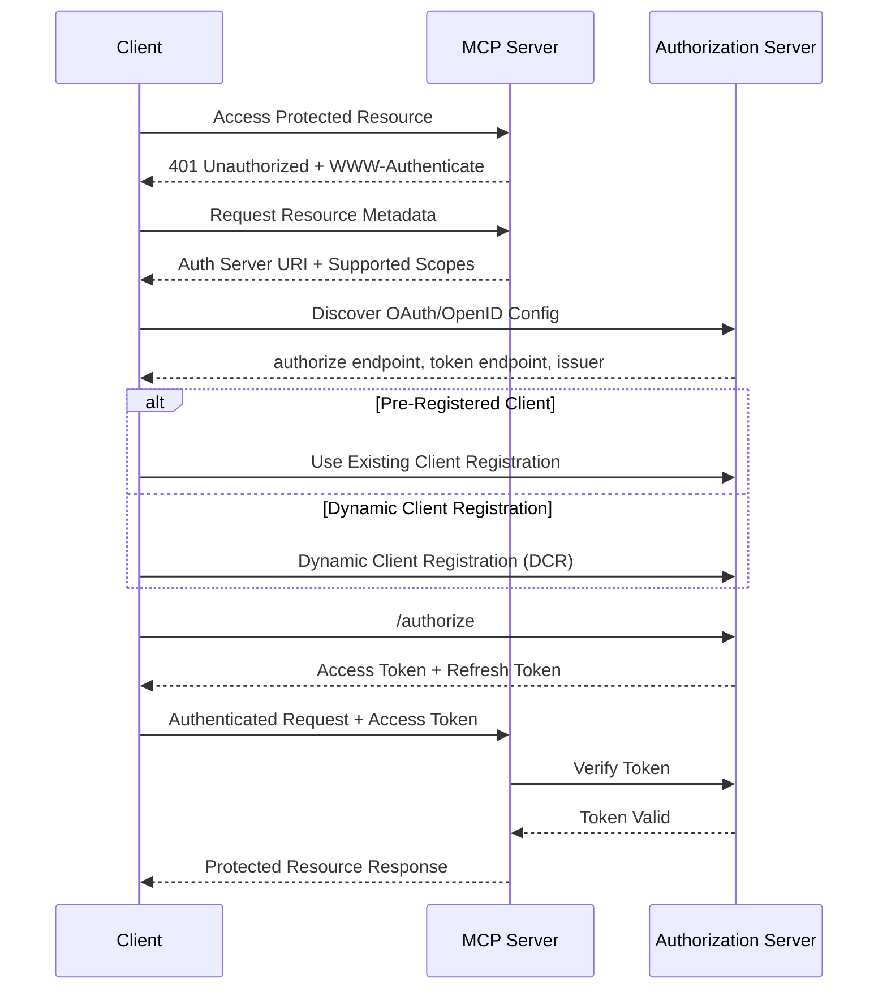
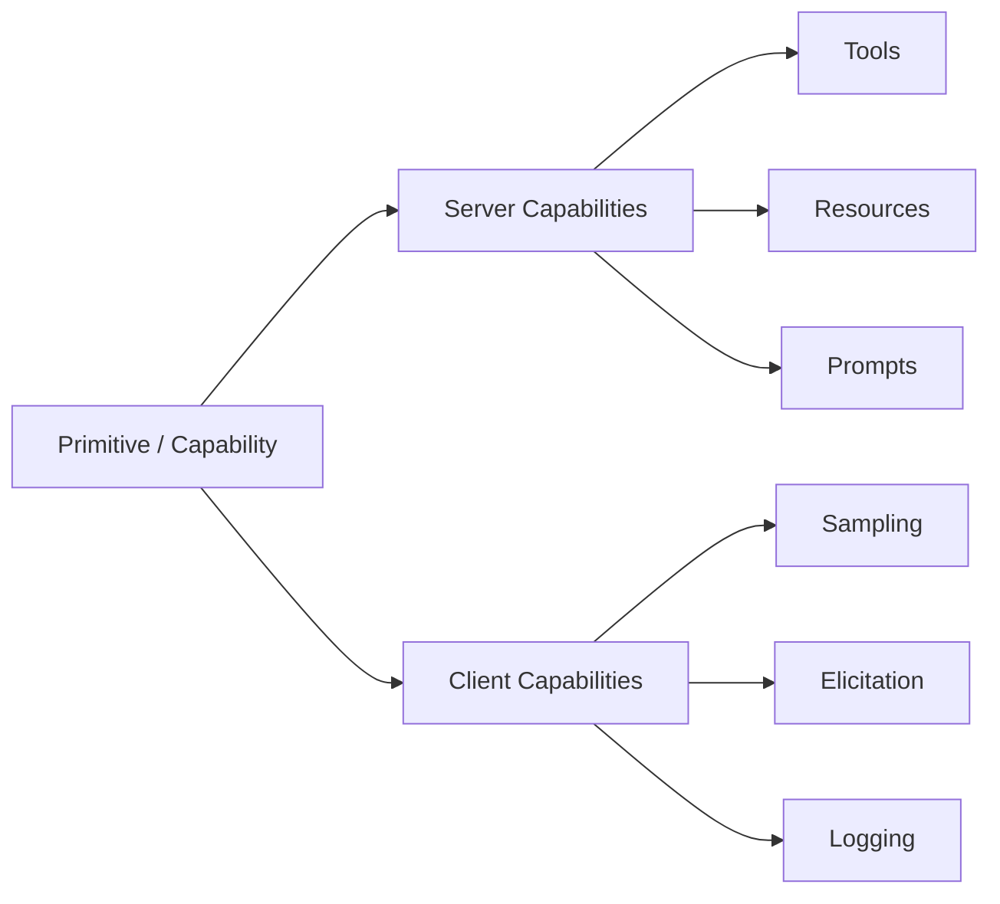
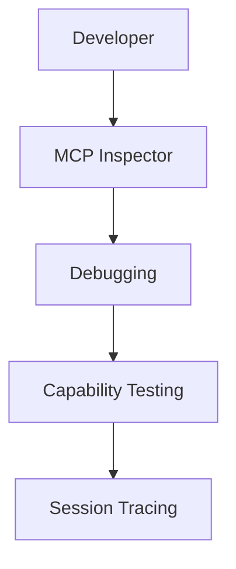
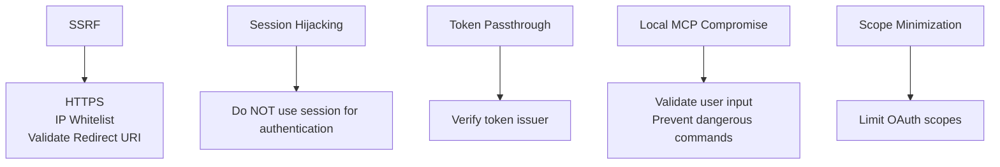

Model Context Protocol (MCP) is an open standard that enables AI models to securely connect with external tools, data sources, and applications. It acts as a bridge between AI systems and services such as databases, APIs, file systems, and business platforms, allowing models to access real-time information and perform actions beyond their built-in knowledge. By standardizing these connections, MCP simplifies integration, improves interoperability, and helps developers build more powerful and context-aware AI applications.

<!--more-->

## High-Level MCP Architecture

## MCP Lifecycle Management

## Data Layer Features

## Transport Layer & Stateful Sessions

## OAuth 2 Security Flow for MCP

## Primitive & Capability Relationship

## Developer Tooling

## MCP Security Risks & Mitigations

