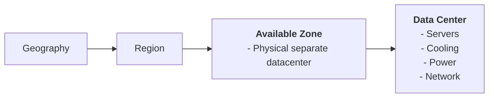
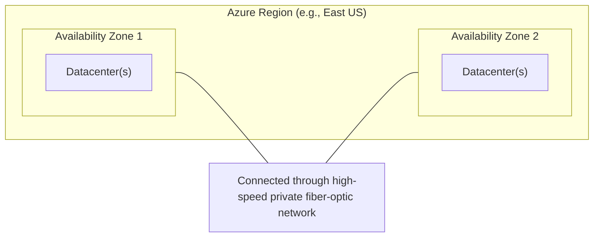
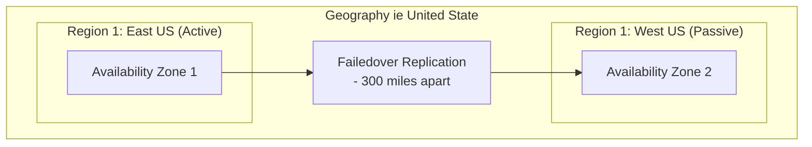
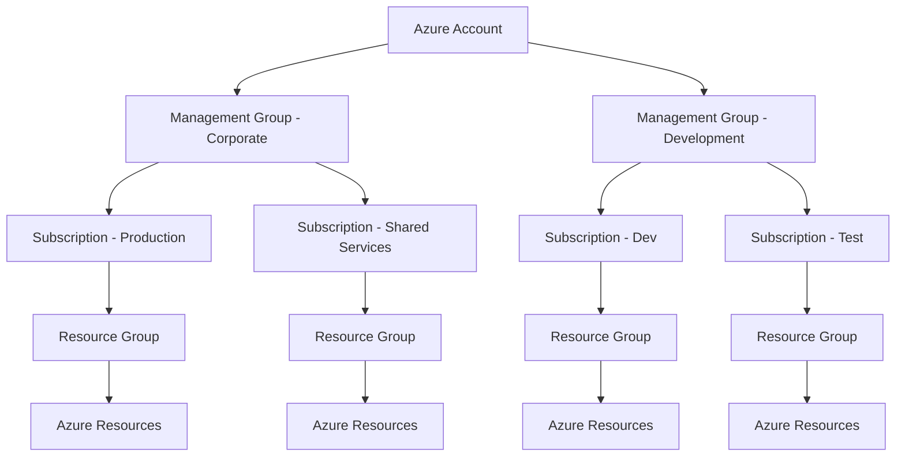
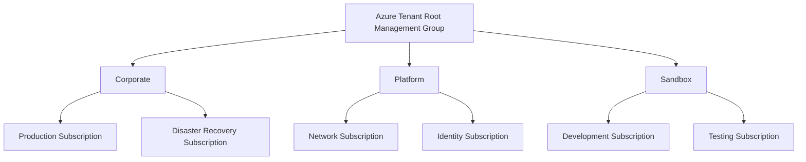

Core components of Azure can be categorized into 2 main groups: the physical infrastructure and the management infrastructure

<!--more-->

## Physical Infrastructure

How Azure organize resources:

Azure Region & availability zones:

- To ensure the resiliency, a minimum of 3 AZs are present in availability zone-enabled region.

Azure region pairs:

- Replicate resource across geography. Reducing natural disaster, power outages, or physical network outages.
- Not all azure service automatically replicate data or fall back from a failed region.
- Most regions are paired in 2 directions.

## Management Infrastructure

| Level            | Purpose                                                                           |
| ---------------- | --------------------------------------------------------------------------------- |
| Azure Account    | Identity used to create and manage Azure environment and billing                  |
| Management Group | It's logical. Used for governance, policies, and permission across subscriptions. |
| Subscription     | Billing, and administrative boundary for Azure resources                          |
| Resource Group   | Logicall container for Azure resource                                             |
| Resource         | Azure resource such as database, VM, App                                          |

Resource Group:

- Each resource can belong to only 1 resource group. Resource can be moved to other group.
- Delete resource group will delete all attached resource
- Can rename after created.
- Resource group can't be nested inside other groups.
- Access permissions are applied to all resources.

Management Group:

- A directory can have up to 1000 management group.
- Each subcription and management group can have only 1 parent
- Nesting: up to 6 level deep (exclude root and subscription levels)

An example how large organizations commonly structure governance using the management group.

