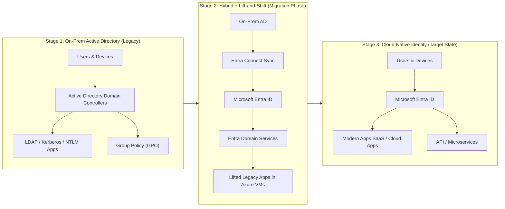
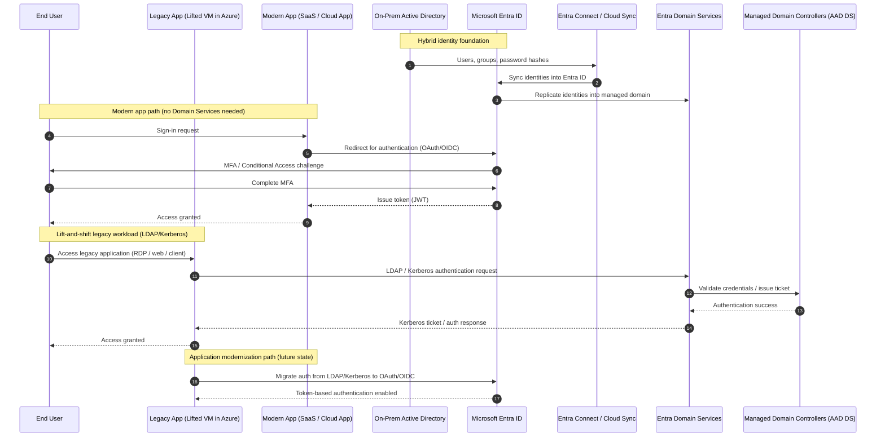
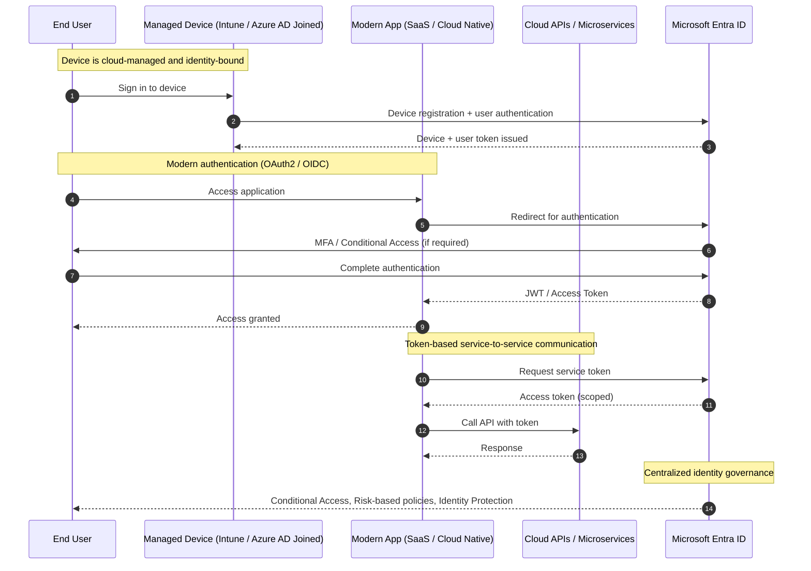

<!--more-->

## Microsoft Entra ID

## Lift-and-shift migration using Microsoft Entra Domain Services

A demonstrated approach to lift-and-shift migration using Microsoft Entra Domain with Microsoft Entra ID and (optionally) on-prem Active Directory.

Migration roadmap: 3 stages (demonstration)

### Stage 2: lift-and-shift

Hybrid identity foundation

- On-prem AD still exists (common in real enterprises)
- Identity is synchronized into Microsoft Entra ID
- Then propagated into Microsoft Entra Domain Services for legacy workloads

Two authentication worlds running in parallel

1/ Modern apps (preferred path)

- OAuth / OpenID Connect
- Entra ID issues tokens
- MFA + Conditional Access enforced

2/ Legacy lifted apps

- LDAP / Kerberos / NTLM
- Domain-joined VMs in Azure
- Authentication handled via Entra Domain Services

Migration end-state direction - Move applications away from LDAP/Kerberos → toward Entra ID token-based auth

- Entra Domain Services usage decreases
- Legacy dependencies are removed
- Identity becomes fully cloud-native

### Stage 3: Cloud-Native Identity, No Domain Services

> **Main idea:** identity becomes token-based, not domain-based

Everything uses:

- OAuth2 / OpenID Connect
- JWT tokens
- Conditional Access
- Zero Trust

No need for:

- LDAP
- Kerberos
- Domain join for apps
- Domain Services
